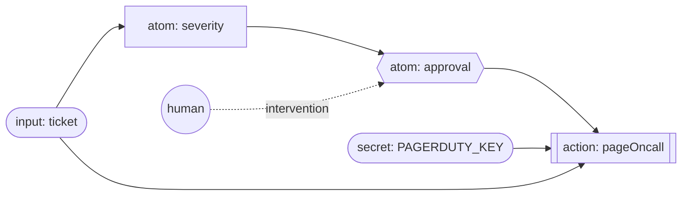
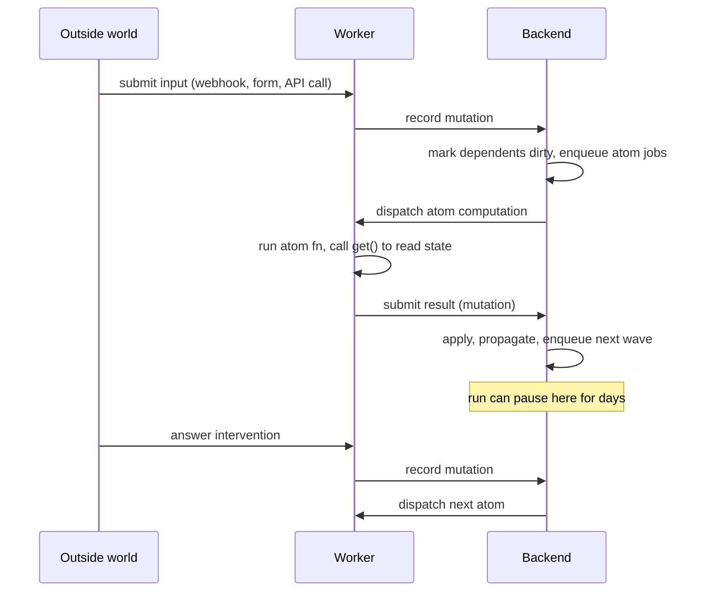
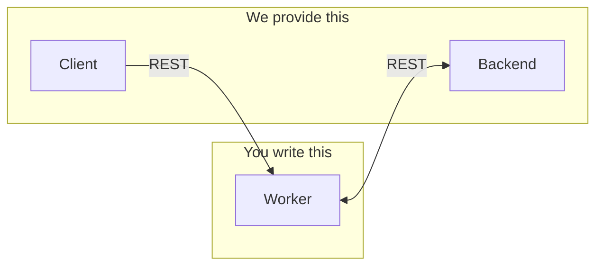

# Hylo

Hylo lets you write long-running, human-in-the-loop workflows the same way you write React components: declare values, derive new values from them, and fire side effects when the user does something. Runs are **durable** — they can pause for days waiting on a human and resume exactly where they left off.

## A small example

```ts
import { atom, action, input, secret } from "@workflow/core";
import { z } from "zod";

const ticket = input("ticket", z.object({ id: z.string(), body: z.string() }));

const severity = atom(async (get) => {
  const t = await get(ticket);
  return t.body.includes("outage") ? "sev-1" : "sev-3";
});

const approval = atom(async (get, requestIntervention) => {
  if ((await get(severity)) !== "sev-1") return { approved: false };
  return requestIntervention(
    "page-oncall",
    z.object({ approved: z.boolean(), note: z.string().optional() }),
    {
      title: "Page on-call?",
      description: `Ticket ${(await get(ticket)).id} looks like a sev-1.`,
    },
  );
});

const pagerDutyKey = secret("PAGERDUTY_KEY", process.env.PAGERDUTY_KEY);

const pageOncall = action(async (get) => {
  if (!(await get(approval)).approved) return;
  await pd.page({ key: await get(pagerDutyKey), ticket: await get(ticket) });
});
```

Supplying a `ticket` value starts a run. `severity` is derived from it. `approval` reads `severity` and, if the ticket is sev-1, calls `requestIntervention` — the run pauses there until a human submits the form. Once they do, `approval` resolves, and `pageOncall` (a side effect that reads the current graph) can fire.



## How to express workflows

Five primitives, all from `@workflow/core`:

```ts
input(name, schema)              // data from the outside world (Zod-validated)
atom(fn, opts?)                  // derived value, recomputes when its deps change
action(fn, opts?)                // side effect, runs when invoked
secret(name, value)              // env-backed value, resolved on your worker
schedule(id, cron, { trigger, payload }) // start a run on a recurring cadence
```

Inside any `atom` or `action`:

```ts
await get(otherAtom);                  // read a value (subscribes to it)
await requestIntervention({ schema }); // pause the run until a human submits
```

That's it. You don't write a state machine, a DAG, or a step definition — you just declare values and the relationships between them, and Hylo figures out what to run and when.

## The React/Jotai mental model

If you've used Jotai or Recoil, this is the same idea. If you've used React hooks, this maps cleanly:

| Hylo            | React / Jotai analog         | What it is                                                                  |
| --------------- | ---------------------------- | --------------------------------------------------------------------------- |
| `input(...)`    | event payload / `useState`   | A value supplied from outside. A run starts when one is set.                |
| `atom(...)`     | `useMemo` / Jotai `atom`     | Derived value. Cached. Recomputes when a dep changes.                       |
| `action(...)`   | `useCallback`                | Invokable side effect. Pull-only. Result cached per call.                   |
| `secret(...)`   | `useContext` for env         | Env-backed value; resolved on the worker, redacted in state.                |
| `schedule(...)` | `setInterval` / cron job     | Cadence-driven trigger. Each tick starts a fresh run with a fixed payload.  |
| `get(atom)`     | reading a hook / Jotai `get` | Subscribes the caller; fans out on change.                                  |

Under the hood Hylo is doing what a signals library does:

1. **A state manager** holds the value of every atom and input in a run.
2. **A queue of mutations** (new inputs, completed atom computations, user interventions) arrives over time.
3. **A scheduler** applies each mutation, marks dependents dirty, and enqueues the atoms/actions that need to re-run.
4. **Workers** — user-defined code — resolve those enqueued computations and push results back as more mutations.

React does this in memory, in one process, for a single render. Hylo does it across processes and across time: the state manager is a database, the mutation queue is durable, and the workers are HTTP services you own. A workflow run is just a very long, very pausable `useSyncExternalStore` subscription.



This is why the same code can pause for five days waiting on a human approval and resume. The graph isn't running — its state is at rest in the backend, and a mutation (the human's submission) kicks the scheduler back to life.

## How enqueuing works

Every unit of work flows through one durable queue on the backend. Items have two shapes:

- **`input`** — a value arrived from outside (a `POST /runs/:runId/inputs`, a webhook, a form submission). The scheduler writes the payload into run state and marks every atom that reads that input as dirty.
- **`step`** — re-run a specific atom or action. Emitted whenever a step's dependency just resolved, or whenever a human submitted the intervention a step was paused on.

Each item moves through a fixed lifecycle: `pending → running → completed | failed`. A worker claims a `pending` item, runs the step, and reports the result back. Running an item can emit more events — resolving `severity` enqueues a `step` for `approval` because `approval` reads it — and that cascade continues until the queue drains.

Pausing on user input works through the same queue:

1. `approval` calls `requestIntervention("page-oncall", ...)`. There's no response in state yet, so the runtime throws a `WaitError`.
2. The scheduler catches it, records `approval` as a waiter on the intervention id, and **does not** enqueue any dependents. The run goes idle.
3. The human submits a response via `POST /runs/:runId/interventions/:id`. The scheduler writes that payload into the run's key-value input state under the intervention id, finds every waiter for that id, and enqueues a fresh `step` event for each.
4. A worker dequeues the `step`, re-runs `approval`, finds the response already in state this time, and returns normally. `pageOncall`'s `step` then enqueues, and the cascade resumes.

Because the queue is a database table (`workflow_queue_items`), the days between step 2 and step 3 cost nothing — no process is held open, and any worker can pick the run back up.

## Recurring runs (`schedule`)

Most workflows start because the outside world did something — a webhook arrived, a human filled out a form. Some need to start on a clock instead: a nightly sweep, a 15-minute health check, a Monday-morning report. `schedule()` declares that contract alongside the workflow itself, so the cadence travels with the code.

```ts
import { input, schedule } from "@workflow/core";
import { z } from "zod";

const sweep = input(
  "sweep",
  z.object({ region: z.string(), windowMinutes: z.number() }),
);

schedule("nightly-us-sweep", "0 3 * * *", {
  trigger: sweep,
  payload: { region: "us-east-1", windowMinutes: 60 },
  description: "Nightly US sweep at 03:00 UTC.",
});

schedule("eu-15m-sweep", "*/15 * * * *", {
  trigger: sweep,
  payload: { region: "eu-west-1", windowMinutes: 15 },
});
```

Each tick that matches the cron starts a fresh run, exactly as if `POST /runs` had been called with `{ inputId: "sweep", payload: {...} }`. Everything downstream of the input — atoms, actions, interventions — behaves identically to a manually-started run. There is no separate "scheduled run" concept.

**Cron syntax.** Standard 5-field POSIX (`minute hour day-of-month month day-of-week`) evaluated in **UTC**. Supports `*`, `*/N`, `a-b`, `a,b,c`, and combinations (`0-30/10`). Day-of-week treats both `0` and `7` as Sunday. No `@daily`-style aliases; no seconds field.

**Two forms.** Pick based on whether the trigger should also be runnable by hand:

```ts
// 1. Explicit-trigger form. The input shows up in the "Start the workflow"
//    UI list — humans can fire it manually too. Use when several schedules
//    share one trigger (e.g. a sweep with us + eu schedules), or when ops
//    needs a "run now" button alongside the cron.
const sweep = input("sweep", schema);
schedule("nightly-us", "0 3 * * *", { trigger: sweep, payload: {...} });

// 2. Schema form. schedule() creates a hidden internal input under the
//    covers — nothing appears in the UI, the schedule is the only entry
//    point. Use when the workflow is purely scheduled.
schedule("nightly-us", "0 3 * * *", {
  schema: z.object({ region: z.string() }),
  payload: { region: "us-east-1" },
});
```

**Rules.**

- `id` is unique across the whole registry — same namespace as inputs/atoms/actions. Pick a stable name; the dispatcher uses it as a key, and the schema form derives the hidden input id from it (`__schedule_<id>`).
- The trigger must be an `input(...)` (or `input.deferred(...)`), not an atom/action. The schedule fires the input the same way an external request would.
- `payload` is captured at registration time and validated against the input's Zod schema on every fire. If the schema is `z.object({ region: z.string() })`, the payload must match.
- The explicit-trigger form lets the same input back many schedules with different payloads.
- An `input(..., { internal: true })` is hidden from the UI start list — equivalent to what the schema form does automatically. Use this when several schedules share one trigger but you don't want a manual run button for it.

**How it actually fires.** The workflow server exposes one HTTP route:

```
POST /schedules/tick    Body: { at?: ISO-8601 }    → { at, fired[], skipped[] }
```

Whoever hits that endpoint says "evaluate every registered schedule against this timestamp; start a run for each match." The workflow server does the cron eval — it never imports a cron library on the dispatcher side. `at` defaults to the server's clock if omitted.

That single route is the contract. The executing platform is free to drive it however its native primitives allow:

| Platform                 | How it ticks `/schedules/tick`                                                  |
| ------------------------ | ------------------------------------------------------------------------------- |
| Cloudflare Workers       | One coarse cron trigger (`* * * * *`) on the backend worker fans out to tenants |
| AWS Lambda               | EventBridge rule on a 1-minute schedule invokes a dispatcher Lambda             |
| Plain Node host          | `node-cron` or `setInterval` posting to the local workflow server               |
| GitHub Actions / Render  | A scheduled job that `curl`s `/schedules/tick` once a minute                    |

`@hylo/backend` ships `dispatchTickToDeployments({ source })` — a platform-agnostic helper that fans the tick out across every registered workflow deployment. `apps/backend-cloudflare` wires that helper into Cloudflare's `scheduled()` handler; the wrangler config has exactly one cron line (`* * * * *`) and no per-workflow code. To support a new platform you write a small adapter that calls `dispatchTickToDeployments` from the platform's native trigger — workflow code is untouched.

**Schedules in the manifest.** `GET /manifest` returns each registered schedule:

```json
{
  "schedules": [
    {
      "id": "nightly-us-sweep",
      "cron": "0 3 * * *",
      "inputId": "sweep",
      "description": "Nightly US sweep at 03:00 UTC."
    }
  ]
}
```

This is what tooling, dashboards, and dispatcher implementations introspect. Changes to a schedule (new id, different cron, different payload) bump the workflow's `codeHash`, so deploys are versioned the same way as atom/action changes.

**Operating notes.**

- **Skew.** The dispatcher matches schedules against the *minute* it fires for. If the platform tick is delayed by 30 seconds, your `*/15 * * * *` still fires at `:15`, not at `:14:30`. If the tick gets skipped entirely (cold start, outage), that minute does not fire — schedules are not catch-up-replayed. Design for at-most-once-per-minute, not exactly-once.
- **Backfills.** Need to re-run a missed sweep? `POST /schedules/tick` with `{ "at": "2026-04-27T15:00:00Z" }` to drive any specific minute. Or just `POST /runs` directly with the same `inputId` + payload.
- **Disabling a schedule.** Delete (or comment out) the `schedule()` call and redeploy. The dispatcher only knows about schedules in the current manifest.

## Architecture

Three pieces:



The **worker** holds your workflow code and secrets. The **backend** is the state manager and mutation queue. The **client** renders whichever worker it points at (which in turn reads from the backend). Client calls go through the worker — the backend doesn't need to know what a workflow *is*, only what's at rest and what's enqueued.

### Worker (you write this)

Your code. Imports `@workflow/server`, declares atoms/actions/inputs, and runs in whatever runtime you already have (Next.js route, Hono app, Cloudflare Worker). You own its env vars and secrets; workflow code never leaves your process.

It's the "user-defined worker" from the mental model above — when the scheduler needs an atom computed, it calls an HTTP route on your worker.

### Backend (we provide this)

A managed REST API. Owns the durable state manager (run state, events, run documents) and the mutation queue. Stateless with respect to workflow code — it addresses work by `workflowId` + `runId` and dispatches it to your worker over HTTP.

The backend lives in `apps/backend-cloudflare`: a Cloudflare Worker backed by Postgres. It uses a Cloudflare Hyperdrive binding when available, and can fall back to `POSTGRES_URL` or `DATABASE_URL`.

The Cloudflare backend also hosts an **OAuth broker** at `/oauth`. Provider client secrets (Spotify, Notion, …) live on the backend, not on workers — workers only ever see resolved access tokens.

### Pairing

Backend and worker talk HTTP both directions, so both must be reachable by the other:

- **Local**: `backend-cloudflare` through Wrangler + a locally-running worker
- **Cloud**: `backend-cloudflare` + a cloud-deployed worker

Mixing a local worker with a cloud backend won't work without tunneling.

### Client

`apps/client` — React SPA that points at a worker and visualizes its graph, pending inputs, interventions, and queue. The worker serves the UI-facing data (using state it reads from the backend).

## Monorepo layout

```
apps/
  backend-cloudflare/ Cloud backend (Cloudflare Worker + Postgres)
  client/             React UI (Vite)

packages/
  core/           Primitives: atom, action, input, secret
  runtime/        Scheduler + registry + executor
  server/         Worker SDK — createWorkflow() mounts HTTP routes
  remote/         REST transport between worker and backend
  postgres/       Postgres schema + migration helpers
  oauth-broker/   Backend-hosted OAuth broker (mounted at /oauth)
  frontend/       React components (WorkflowSinglePage)
  integrations/   Worker-side OAuth + service integrations
  demo-workflow/  Reference workflow used by the client

examples/
  nextjs/              Worker example (Next.js app with workflows)
  cloudflare-worker/   Worker example (Cloudflare Worker with workflows)
```

## Worker SDK

```ts
import { createWorkflow } from "@workflow/server";
import "./workflows"; // side-effect import registers atoms/actions/inputs

const app = createWorkflow({
  basePath: "/api/workflow",
  backendApi: process.env.HYLO_BACKEND_URL!,
  workflow: { id: "my-app", version: "v1", name: "My App" },
});
```

Returns a Hono app. Mount it anywhere that serves HTTP. Worker routes include:

- `GET  /health`, `/manifest`, `/runs`, `/runs/:runId`
- `POST /runs`, `/runs/:runId/inputs`, `/runs/:runId/interventions/:id`
- `POST /runs/:runId/advance`, `/runs/:runId/auto-advance`
- `POST /webhooks` — match a webhook payload to one or more `input()` schemas and start (or resume) a run
- `POST /schedules/tick` — evaluate registered `schedule()` definitions against `{ at }` and start a run for each match

## Backend API

Mounted under `/runtime`. OpenAPI docs at `/runtime/openapi.json`.

- `GET/PUT /runs/:runId/state`
- `GET/PUT /runs/:runId/document`
- `GET  /runs/:runId/events`, `POST /events`
- `POST /queue/enqueue`, `POST /queue/:runId/claim`
- `POST /queue/:eventId/complete`, `POST /queue/:eventId/fail`
- `GET  /queue/:runId/snapshot`, `/queue/:runId/size`

## Quickstart

Requires Node 22+ and pnpm 10.26.

```sh
pnpm install
pnpm dev
```

Open the Vite URL printed by `apps/client`.

`pnpm dev` runs the Cloudflare backend, Cloudflare workflow example, and client
through their package-owned `dev` scripts. It chooses available local ports for
the Cloudflare services, starting from `8787` for the backend and `8788` for
the workflow example. Set `HYLO_BACKEND_PORT` or
`HYLO_CLOUDFLARE_WORKER_PORT` to force specific ports.

### Hylo CLI

The Hylo CLI is the customer-facing workflow CLI. It authenticates with WorkOS
and deploys tenant-scoped workflow workers through the backend deployments API.

```sh
pnpm hylo auth login
pnpm hylo deploy
pnpm hylo deployments list
```

Platform infrastructure uses normal vendor tooling: deploy the backend with
Wrangler and the browser app with Vercel.

### Backend DB

For the Cloudflare backend:

```sh
cd apps/backend-cloudflare
POSTGRES_URL=postgres://... pnpm db:migrate
POSTGRES_URL=postgres://... pnpm db:studio
```

Postgres migration helpers live in `packages/postgres` and require
`POSTGRES_URL` or `DATABASE_URL`. Local `wrangler dev` can use Hyperdrive's
`CLOUDFLARE_HYPERDRIVE_LOCAL_CONNECTION_STRING_HYPERDRIVE` override, or the
Worker can read `POSTGRES_URL`/`DATABASE_URL` directly.

## Scripts

| Command      | What it does                                    |
| ------------ | ----------------------------------------------- |
| `pnpm dev`   | Run the default local Hylo profile              |
| `pnpm build` | Typecheck + build all packages                  |
| `pnpm test`  | Run test suites                                 |
| `pnpm fmt`   | Biome format + autofix                          |
| `pnpm check` | Biome CI check                                  |

See `examples/nextjs` for a complete worker, including OAuth via the broker.
