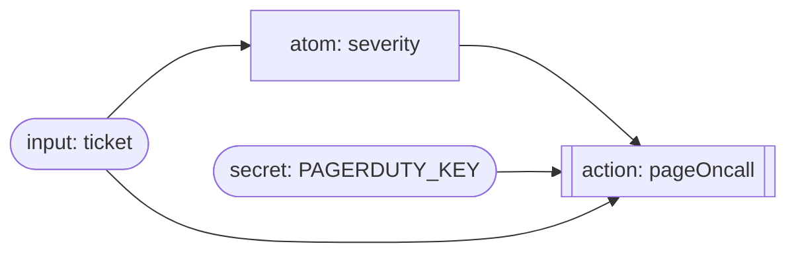
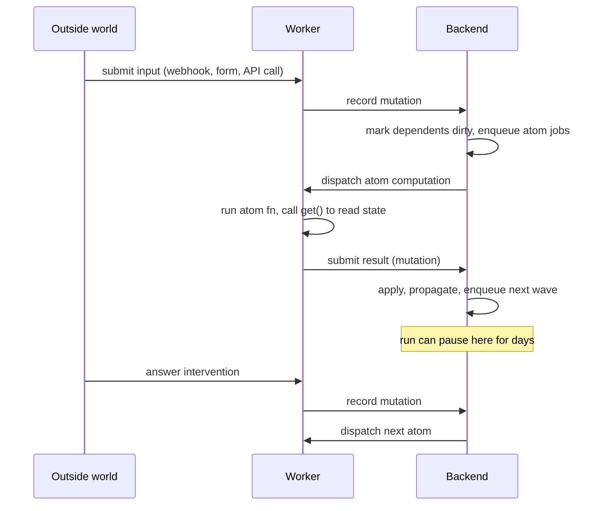
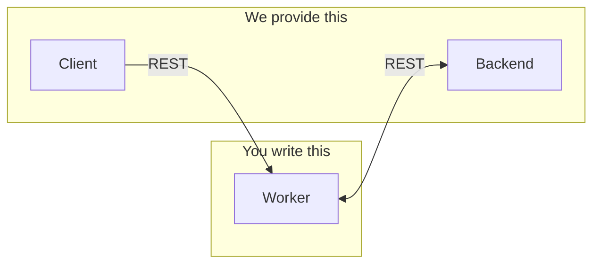

# Hylo

Hylo lets you write long-running, human-in-the-loop workflows the same way you write React components: declare values, derive new values from them, and fire side effects when the user does something. Runs are **durable** — they can pause for days waiting on a human and resume exactly where they left off.

## A small example

```ts
import { atom, action, input, secret } from "@workflow/core";
import { z } from "zod";

const ticket = input("ticket", z.object({ id: z.string(), body: z.string() }));

const severity = atom(async (get) => {
  const t = await get(ticket);
  return t.body.includes("outage") ? "sev-1" : "sev-3";
});

const pagerDutyKey = secret("PAGERDUTY_KEY", process.env.PAGERDUTY_KEY);

const pageOncall = action(async (get) => {
  if ((await get(severity)) !== "sev-1") return;
  await pd.page({ key: await get(pagerDutyKey), ticket: await get(ticket) });
});
```

Supplying a `ticket` value starts a run. `severity` is derived from it. When `severity` changes, anything that depends on it re-evaluates. `pageOncall` is a side effect that reads the current value of the graph when invoked.



## How to express workflows

Four primitives, all from `@workflow/core`:

```ts
input(name, schema) // data from the outside world (Zod-validated)
atom(fn, opts?)     // derived value, recomputes when its deps change
action(fn, opts?)   // side effect, runs when invoked
secret(name, value) // env-backed value, resolved on your worker
```

Inside any `atom` or `action`:

```ts
await get(otherAtom);                  // read a value (subscribes to it)
await requestIntervention({ schema }); // pause the run until a human submits
```

That's it. You don't write a state machine, a DAG, or a step definition — you just declare values and the relationships between them, and Hylo figures out what to run and when.

## The React/Jotai mental model

If you've used Jotai or Recoil, this is the same idea. If you've used React hooks, this maps cleanly:

| Hylo          | React / Jotai analog         | What it is                                                   |
| ------------- | ---------------------------- | ------------------------------------------------------------ |
| `input(...)`  | event payload / `useState`   | A value supplied from outside. A run starts when one is set. |
| `atom(...)`   | `useMemo` / Jotai `atom`     | Derived value. Cached. Recomputes when a dep changes.        |
| `action(...)` | `useCallback`                | Invokable side effect. Pull-only. Result cached per call.    |
| `secret(...)` | `useContext` for env         | Env-backed value; resolved on the worker, redacted in state. |
| `get(atom)`   | reading a hook / Jotai `get` | Subscribes the caller; fans out on change.                   |

Under the hood Hylo is doing what a signals library does:

1. **A state manager** holds the value of every atom and input in a run.
2. **A queue of mutations** (new inputs, completed atom computations, user interventions) arrives over time.
3. **A scheduler** applies each mutation, marks dependents dirty, and enqueues the atoms/actions that need to re-run.
4. **Workers** — user-defined code — resolve those enqueued computations and push results back as more mutations.

React does this in memory, in one process, for a single render. Hylo does it across processes and across time: the state manager is a database, the mutation queue is durable, and the workers are HTTP services you own. A workflow run is just a very long, very pausable `useSyncExternalStore` subscription.



This is why the same code can pause for five days waiting on a human approval and resume. The graph isn't running — its state is at rest in the backend, and a mutation (the human's submission) kicks the scheduler back to life.

## Architecture

Three pieces:



The **worker** holds your workflow code and secrets. The **backend** is the state manager and mutation queue. The **client** renders whichever worker it points at (which in turn reads from the backend). Client calls go through the worker — the backend doesn't need to know what a workflow *is*, only what's at rest and what's enqueued.

### Worker (you write this)

Your code. Imports `@workflow/server`, declares atoms/actions/inputs, and runs in whatever runtime you already have (Next.js route, Hono app, Cloudflare Worker). You own its env vars and secrets; workflow code never leaves your process.

It's the "user-defined worker" from the mental model above — when the scheduler needs an atom computed, it calls an HTTP route on your worker.

### Backend (we provide this)

A managed REST API. Owns the durable state manager (run state, events, run documents) and the mutation queue. Stateless with respect to workflow code — it addresses work by `workflowId` + `runId` and dispatches it to your worker over HTTP.

Two deployable flavors of the **same** backend:

- `apps/backend-node` — Node + PGlite (alternate local dev)
- `apps/backend-cloudflare` — Cloudflare Worker + D1 (the cloud backend; also runs locally via Wrangler)

The Cloudflare backend also hosts an **OAuth broker** at `/oauth`. Provider client secrets (Spotify, Notion, …) live on the backend, not on workers — workers only ever see resolved access tokens.

### Pairing

Backend and worker talk HTTP both directions, so both must be reachable by the other:

- **Local**: `backend-node` + a locally-running worker (e.g. `examples/nextjs`)
- **Cloud**: `backend-cloudflare` + a cloud-deployed worker

Mixing a local worker with a cloud backend won't work without tunneling.

### Client

`apps/client` — React SPA that points at a worker and visualizes its graph, pending inputs, interventions, and queue. The worker serves the UI-facing data (using state it reads from the backend).

## Monorepo layout

```
apps/
  backend-cloudflare/ Cloud backend (Cloudflare Worker + D1)
  backend-node/       Alternate local backend (Node + PGlite)
  client/             React UI (Vite)

packages/
  core/           Primitives: atom, action, input, secret
  runtime/        Scheduler + registry + executor
  server/         Worker SDK — createWorkflow() mounts HTTP routes
  remote/         REST transport between worker and backend
  cloudflare/     D1 adapters for apps/backend-cloudflare
  postgres/       Drizzle schema + adapters for apps/backend-node
  oauth-broker/   Backend-hosted OAuth broker (mounted at /oauth)
  frontend/       React components (WorkflowSinglePage)
  integrations/   Worker-side OAuth + service integrations
  demo-workflow/  Reference workflow used by the client

examples/
  nextjs/              Worker example (Next.js app with workflows)
  cloudflare-worker/   Worker example (Cloudflare Worker with workflows)
```

## Worker SDK

```ts
import { createWorkflow } from "@workflow/server";
import "./workflows"; // side-effect import registers atoms/actions/inputs

const app = createWorkflow({
  basePath: "/api/workflow",
  backendApi: process.env.HYLO_BACKEND_URL!,
  workflow: { id: "my-app", version: "v1", name: "My App" },
});
```

Returns a Hono app. Mount it anywhere that serves HTTP. Worker routes include:

- `GET  /health`, `/manifest`, `/runs`, `/runs/:runId`
- `POST /runs`, `/runs/:runId/inputs`, `/runs/:runId/interventions/:id`
- `POST /runs/:runId/advance`, `/runs/:runId/auto-advance`

## Backend API

Mounted under `/runtime` on both flavors. OpenAPI docs at `/runtime/openapi.json`.

- `GET/PUT /runs/:runId/state`
- `GET/PUT /runs/:runId/document`
- `GET  /runs/:runId/events`, `POST /events`
- `POST /queue/enqueue`, `POST /queue/:runId/claim`
- `POST /queue/:eventId/complete`, `POST /queue/:eventId/fail`
- `GET  /queue/:runId/snapshot`, `/queue/:runId/size`

## Postgres schema (`backend-node`)

| Table                    | Purpose                                         |
| ------------------------ | ----------------------------------------------- |
| `workflow_run_states`    | Versioned run state snapshots                   |
| `workflow_run_documents` | Run metadata + trace + status                   |
| `workflow_events`        | Append-only event log                           |
| `workflow_queue_items`   | Work queue with leases, retries, attempt counts |

## Quickstart

Requires Node 22+ and pnpm 10.26.

```sh
pnpm install
pnpm dev
```

Open `https://hylo.localhost`.

`pnpm dev` starts the `local` profile from `hylo.json`: the Node backend, the
Next.js workflow server, and the client.

### Hylo CLI

The Hylo CLI reads `hylo.json` and launches or deploys a profile. A profile is
a set of targets: one backend, one app, and one or more workflow servers. Hylo
uses that graph to inject the backend URL into workflows and the workflow
registry into the app.

This repo ships two profiles:

- `local` — Node backend, Next.js workflow, Vite client
- `remote` — Cloudflare backend, Cloudflare workflow, Vercel client

Common commands:

```sh
pnpm hylo dev
pnpm hylo env remote
pnpm hylo deploy remote
pnpm hylo exec remote -- env
```

Run `pnpm hylo --help` for target registration and profile editing commands.

### Backend DB

For the default local Node backend:

```sh
cd apps/backend-node
pnpm db:migrate
pnpm db:studio
```

For the local Cloudflare backend:

```sh
cd apps/backend-cloudflare
pnpm db:migrate
pnpm db:studio
```

For the deployed Cloudflare backend, run `pnpm db:migrate:remote` from
`apps/backend-cloudflare`.

## Scripts

| Command      | What it does                                    |
| ------------ | ----------------------------------------------- |
| `pnpm dev`   | Run the default local Hylo profile              |
| `pnpm build` | Typecheck + build all packages                  |
| `pnpm test`  | Run test suites                                 |
| `pnpm fmt`   | Biome format + autofix                          |
| `pnpm check` | Biome CI check                                  |

See `examples/nextjs` for a complete worker, including OAuth via the broker.
