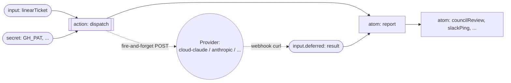

# @workflow/integrations-managed-agent

Generic managed-agent primitives for hylo workflows. One package, composable adapters. Primitive selection follows [Anthropic's Managed Agents framework](https://www.anthropic.com/engineering/managed-agents) — Session, Orchestration, Harness, Sandbox, Resources, Tools — narrowed to what hylo workflows need today.

## What "agent" means in Hylo's graph

This package does not introduce a new node kind. An agent is a **3-node sub-graph** assembled from Hylo's existing primitives:



| sub-graph node | Hylo primitive | role |
|---|---|---|
| `dispatch` | `action(...)` | side effect — opens the session, sets env, fires the prompt |
| `result` (you provide) | `input.deferred(...)` | pauses the run; resolved when the agent inside the sandbox curls the webhook |
| `report` | `atom(...)` | derives the result envelope; depends on both `dispatch` and `result` |

`managedAgent({ provider, sandbox, resources, prompt, result })` is a factory function that registers the action and the atom and joins them to the deferred input you pass in. The "agent" is the conventional shape of those three nodes — same dependency rules, same caching, same replay-safety as any atom/action/input.

The pause/resume semantics are identical to Hylo's `requestIntervention` pattern. The only wrinkle: the deferred input is resolved by an HTTP callback from inside the sandbox rather than a human submitting a form. The run goes idle until a `POST /api/workflow/webhooks` mutation lands, then the scheduler enqueues `report` and the cascade continues.

## Composable axes

The brain (Provider) and the hands (Sandbox) are independent axes. A workflow names a Provider and (when the provider isn't bundled) a Sandbox, declares Resources, and gets back the `(dispatch, report)` pair:

```ts
import {
  managedAgent,
  cloudClaudeProvider,
  resources as r,
} from "@workflow/integrations-managed-agent";

const factory = managedAgent({
  name: "implementCommit",
  provider: cloudClaudeProvider({
    workspace: "daytona-sandbox",   // bundled sandbox — no separate `sandbox:` arg
    model: "claude-opus-4-7",
  }),
  resources: [
    r.secret({ source: githubPat,    env: "SMITHERY_GH_PAT" }),
    r.secret({ source: linearApiKey, env: "LINEAR_API_KEY", optional: true }),
  ],
  prompt: (get, ctx) => buildPrompt({ ticket: get(linearTicket), webhookUrl: ctx.webhookUrl }),
  result: implementResultDeferred,
});

// Downstream atoms read `factory.report` like any other atom.
```

Switching the brain or hands is editing one line:

```ts
// Anthropic API + Daytona, freely composed (both stubs today)
const factory = managedAgent({
  name: "implementCommit",
  provider: anthropicProvider({ apiKey: get(anthropicKey), model: "claude-opus-4-7" }),
  sandbox:  daytonaSandbox({ apiKey: get(daytonaKey), region: "us-east-1" }),
  resources: [
    r.git({ repo: "smithery-ai/mono", mount: "/workspace/repo" }),
    r.secret({ source: githubPat, env: "SMITHERY_GH_PAT" }),
  ],
  prompt: ..., result: ...,
});

// Local dev: claude CLI + tmp dir (both stubs today)
const factory = managedAgent({
  name: "implementCommit",
  provider: claudeAgentSdkProvider({ binary: "/usr/local/bin/claude" }),
  sandbox:  localFsSandbox({ workdir: "/tmp/factory" }),
  resources: [...],
});
```

## Primitives

| primitive | interface | what it abstracts |
|---|---|---|
| `AgentProvider` | `prepareSession`, `configureEnv`, `sendPrompt`, `abort?` | the LLM execution plane (the brain) — the harness loop that turns a prompt into agent effects |
| `Sandbox` | `provision`, `mount`, `stop?`, `cleanup?` | where tool calls execute (the hands) — local fs, Daytona, Docker, etc. |
| `Resource` | declarative `{ source_ref, mount_path }` | git repos, files, secrets, env vars made available to the agent by reference |
| `Tool` | `name` / `description` / `inputSchema` only | future — currently providers expose tools natively to the model |

## Adapters

### Providers (the brain)

| adapter | bundled? | status |
|---|---|---|
| `cloudClaudeProvider` | yes (workspace = sandbox) | implemented |
| `anthropicProvider` | no | stub — interface defined, body throws |
| `claudeAgentSdkProvider` | no | stub — interface defined, body throws |

### Sandboxes (the hands)

| adapter | runs on | status |
|---|---|---|
| `daytonaSandbox` | Daytona managed VMs | stub |
| `localFsSandbox` | local filesystem (dev) | stub |
| `dockerSandbox` | local Docker (dev) | stub |

The cloud-claude+daytona-sandbox combination today is the bundled path: cloud-claude provisions the Daytona sandbox internally via its `workspace` field. Future configurations (anthropicProvider + daytonaSandbox, etc.) will exercise the unbundled path.

## Example workflows

Three minimal workflows showing different brain/hands compositions. Each is the full file an author writes — agent body included.

### 1. Bundled provider — cloud-claude + daytona

The default path. One `provider:` arg, no separate sandbox. Cloud-claude provisions the Daytona substrate internally.

```ts
import { input, secret } from "@workflow/core";
import {
  managedAgent,
  cloudClaudeProvider,
  resources as r,
} from "@workflow/integrations-managed-agent";
import { z } from "zod";

const trigger = input("sweep", z.object({ windowMinutes: z.number() }));

const result = input.deferred(
  "sweepResult",
  z.object({
    runId: z.string(),
    status: z.enum(["completed", "failed"]),
    digest: z.string().nullish(),
    error: z.string().nullish(),
  }),
);

const ghPat = secret("AGENT_GITHUB_PAT", undefined);
const chKey = secret("CH_KEY", undefined);

export const sreSweep = managedAgent({
  name: "sreSweep",
  provider: cloudClaudeProvider({
    workspace: "daytona-sandbox",
    model: "claude-opus-4-7",
  }),
  resources: [
    r.secret({ source: ghPat, env: "SMITHERY_GH_PAT" }),
    r.secret({ source: chKey, env: "CH_KEY" }),
  ],
  prompt: (get, ctx) => `
Inspect ClickHouse traces over the last ${get(trigger).windowMinutes} min.
POST {runId, status, digest} to ${ctx.webhookUrl} (runId="${ctx.runId}").
`,
  result,
});

// Downstream: read sreSweep.report from atoms/actions like any other atom.
```

### 2. Unbundled — Anthropic API + Daytona

Brain (Anthropic API direct, in-process tool loop) and hands (Daytona) are wired separately. Useful when you want a different model than cloud-claude exposes, or want to inspect the tool-call loop.

```ts
import { input, secret } from "@workflow/core";
import {
  managedAgent,
  anthropicProvider,
  daytonaSandbox,
  resources as r,
} from "@workflow/integrations-managed-agent";
import { z } from "zod";

const trigger = input("review", z.object({ prUrl: z.string().url() }));

const result = input.deferred(
  "reviewResult",
  z.object({
    runId: z.string(),
    status: z.enum(["completed", "failed"]),
    verdict: z.enum(["approve", "request_changes"]).nullish(),
    summary: z.string().nullish(),
    error: z.string().nullish(),
  }),
);

const anthropicKey = secret("ANTHROPIC_API_KEY", undefined);
const daytonaKey = secret("DAYTONA_API_KEY", undefined);
const ghPat = secret("AGENT_GITHUB_PAT", undefined);

export const prReview = managedAgent({
  name: "prReview",
  provider: anthropicProvider({
    apiKey: anthropicKey,
    model: "claude-opus-4-7",
  }),
  sandbox: daytonaSandbox({ apiKey: daytonaKey, region: "us-east-1" }),
  resources: [
    r.git({ repo: "smithery-ai/mono", mount: "/workspace/repo" }),
    r.secret({ source: ghPat, env: "GH_PAT" }),
  ],
  prompt: (get, ctx) => `
Review ${get(trigger).prUrl}. Use \`gh pr diff\` against /workspace/repo.
POST {runId, status, verdict, summary} to ${ctx.webhookUrl} (runId="${ctx.runId}").
`,
  result,
});
```

### 3. Local dev — Claude Agent SDK + local-fs

No remote infra. Useful for prototyping or for workflows that intentionally operate against the developer's working tree.

```ts
import { input, secret } from "@workflow/core";
import {
  managedAgent,
  claudeAgentSdkProvider,
  localFsSandbox,
  resources as r,
} from "@workflow/integrations-managed-agent";
import { z } from "zod";

const trigger = input("refactor", z.object({ target: z.string() }));

const result = input.deferred(
  "refactorResult",
  z.object({
    runId: z.string(),
    status: z.enum(["completed", "failed"]),
    filesChanged: z.array(z.string()).default([]),
    error: z.string().nullish(),
  }),
);

const ghPat = secret("AGENT_GITHUB_PAT", undefined);

export const refactor = managedAgent({
  name: "refactor",
  provider: claudeAgentSdkProvider({ binary: "/usr/local/bin/claude" }),
  sandbox: localFsSandbox({ workdir: "/tmp/refactor-work" }),
  resources: [
    r.git({
      repo: "smithery-ai/mono",
      ref: "main",
      mount: "/workspace/repo",
    }),
    r.secret({ source: ghPat, env: "GH_PAT" }),
  ],
  prompt: (get, ctx) => `
Refactor ${get(trigger).target} in /workspace/repo.
POST {runId, status, filesChanged} to ${ctx.webhookUrl} (runId="${ctx.runId}").
`,
  result,
});
```

The shape (`provider`, optional `sandbox`, declarative `resources`, `prompt(get, ctx)`, `result` deferred input) is constant across all three. Swapping a brain or hands is editing one line.

## What the composer handles for you

- **Three-call dispatch dance** (provision session, set env, fire-and-forget prompt) — abstracted behind the Provider interface.
- **Fire-and-forget abort timing** — defaults to a 500 ms `AbortSignal.timeout`, empirically the sweet spot under hylo's queue-lease serialization tolerance. Holds longer than that and you trip `Unable to save run: conflict` collisions.
- **The pull-only-action footgun** — the `report` atom auto-pulls on the dispatch action. Without this, hylo never fires the action because actions are pull-only.
- **Bundled-vs-unbundled provider/sandbox composition** — the composer reads `provider.bundledSandbox` and either skips a separate sandbox provision (when bundled) or requires it (when not). Mismatches throw at `managedAgent()` construction time, not at runtime.
- **Optional secrets** — `r.secret({ ..., optional: true })` drops the resource silently when the source is unbound; required secrets throw with a clear error.

## What stays workflow-specific

- The `input.deferred()` schema for the agent's webhook envelope.
- The prompt builder. The composer gives the builder `runId` and `webhookUrl` via `ctx`.
- Telling the agent in the prompt to `curl ${webhookUrl}` with the result envelope. The agent owns its own back-pressure / retry loop while it runs.

## What's covered today vs. left to the substrate

| concern | covered here | left for hylo / future work |
|---|---|---|
| Session | hylo's `runId` doubles as session id; the workflow's deferred input substitutes for a durable event log | full per-session event log, replayable cursors, snapshot reads |
| Orchestration | hylo's run queue serves as `wake(session_id)` | claim-first wake, restart recovery, multi-worker fencing |
| Harness | `AgentProvider` (`prepareSession` / `configureEnv` / `sendPrompt`) | replay-safe execution, claim fencing on externally visible effects |
| Sandbox | `Sandbox` interface (provision / mount / stop / cleanup) | durable lifecycle events for audit |
| Resources | `Resource` discriminated union | durable mount records, artifact-by-digest references |
| Tools | descriptor type only — providers expose tools internally to the model today | declared topology, frozen tool catalog, descriptor-only exposure with credentials and transport resolved by reference |

## Endpoints

The cloud-claude provider defaults to `https://cloud-claude.smithery.workers.dev`. Override per-provider via the constructor's `baseUrl` option (accepts a literal string for now; can be promoted to a hylo handle later).
